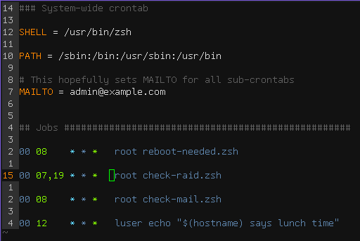

# Introduction

Ever since the dawn of time-telling, humans have been scheduling. Our internal
clocks are surprisingly accurate at telling us when it’s lunch time. Your
internal mealtime crontab might look something like:

    58 11 * * *    head-to-kitchen-for-lunch

That says, every day (the `*`s) run the _head to the kitchen_ routine just
before noon (11:58 AM).

When computers came around, we started programming them to do more
sophisticated scheduling. Nowadays, cron-like schedulers are ubiquitous. If
you try to wake up at 5:45 each weekday morning, you’ve actually set your
alarm clock’s crontab to be:

    # Alarm clock
    48 05 * * mon-fri     bzzz --loop --sleep 10 --max-snoozes 5

Even animals have some interesting schedules. A Canadian Goose is something
like:

    # Migrations
    * * 11 mar *   fly-north
    * * 22 sep *   fly-south

    # Bedtime
    @sundown      go-to-bed

    # Relief (every 5 minutes during waking hours)
    */5 08-17 * * *   crap-on-something

You get the idea.

## What is Cron

Cron is a simple yet very flexible 5-field time-date Domain-Specific Language
(DSL)[^dsl] for scheduling jobs[^jobs]. More specifically, it’s a Job Control
Langauge (JCL). Often, the things being scheduled are database backup jobs,
analytics crunching, log rotations, and many others.

Despite the simple concept of syntax-based scheduling, there’s a lot that can
go wrong when you develop a cron-based system. You need to consider edge
cases, error handling, email communication, output logging, multi-system
interaction, cross-system resource overloading, etc. Furthermore, cron is as
old as computers, so there are many versions of it out in the wild.

In this book, you’ll learn to manage the mainstream versions of cron, and have
visibility into the ongoing jobs you run across all your systems, whether
those are laptops, servers, thermostats, Christmas lights, sprinklers, or
whatever.

Like motherhood, regexes, and apple pie, every developer worth her sugar, at
some point, needs to understand cron.

[^dsl]: As DSL designs go, cron is worthy of study for its conciseness and
  clarity.

## Jobs to Schedule

Computers are constantly running jobs in the background. Some you may be aware
of, most you probably aren’t (or at least shouldn’t be thinking about very
often!). There are three categories of these.

Daemons
: Long-running processes that are started and stopped by the operating system
or super-users. These are often _enabled_ to start at boot time. Daemons do
work on an as-needed basis. Some stay very busy while others only wake up
infrequently. Examples include network file systems, databases, web servers,
time synchronizers, network managers.

Monitors
: Often run every minute or so, looking for exceeded resource limits and
problematic conditions, sounding alarms[^1] when criteria are met. Monitors
are often run as daemons. Examples include monit and nagios. Cron can also
serve well as a monitor for less frequent checks.

Batch Jobs
: Anything with a discrete start and end, often recurring. A batch job can be
run as often as every minute, but usually less frequently. Common frequencies
are once per day and once per hour. These are often maintenance chores, such
as log rotations, database backups, and analytics crunching.

Cron fits into all three categories. It runs constantly as a daemon, checking
every minute to see if there are batch jobs for it to run. Some of those jobs
may be monitoring task.

## History of Cron

The first system credited with implementing a Cron similar to what we use
today was Version 7 UNIX from Bell Labs. Yes, the telephone company. This was
1979. (grab logo: https://en.wikipedia.org/wiki/Bell_Labs#/media/File:Bell_Laboratories_logo.svg)

The most prevalent cron to emerge from a decade of learning about schedulers
was from a developer named Paul Vixie, circa 1987. His eponymous cron is still
in widespread use today.

In 2007, vixie cron was forked by Red Hat to become _cronie_. It later
included Anacron.

## Other Similar Systems
launchd (mac)
Task Scheduler (windows)
systemd timers

## Editor Setup

You’re _almost_ ready to dive into experimenting with crontabs; you’ll want
to make sure your editor is tuned for cron. The most commonly used editor by
sysadmins for remote work is Vi (which is usually the Vim version). Vim
supports a nice syntax highlighting that will dress up a crontab to look
something like this:

The `crontab.vim` syntax file is already included as part of vim. Try opening
you local crontab with:

    EDITOR=vim crontab -e

If you haven’t already, make `EDITOR` a permanent setting in your `~/.bashrc`
or `~/.zshrc`:

    export EDITOR=vim

If you’re having trouble seeing the highlighting, make sure the _filetype_ is
recognized. It may help to save any crontab files you work on with an explicit
`.crontab` suffix. Or, you can add this to the top or bottom of the file:

    # vim:ft=crontab:
