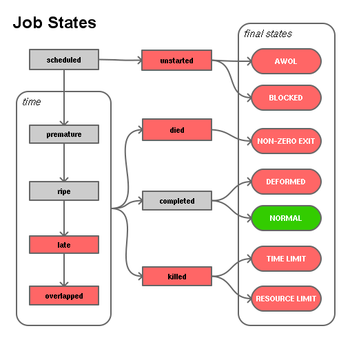

# Instrumenting Jobs

You can wrap jobs.

## Lifecycle of a Job

## Replacing the SHELL

Cron offers a wonderful ability to run jobs in any _shell_ you want. For
demonstration purposes, let’s create our own simple shell; call it _cronsh_.
Put it in your local executable area as `~/bin/cronsh` and ensure it’s in your
`PATH`.

    PATH = ...:/home/mde/bin
    SHELL = cronsh

    00 10 * * *  sayhi

I’ll assume it’s approaching 10:00 AM on your watch; adjust accordingly.

W> ## Warning
W>
W> Notice that I’m not using `~` or `$HOME` in the `PATH`.
W> When those are passed through to `cronsh`, they won’t be expanded to
W> the actual path.

Also create a `sayhi` job script that simply _says “hi”_.

    #! /usr/bin/zsh
    # Ignore anything passed into this script.
    print "Oh, hello."

Our simple `cronsh` shell wrapper is a slightly augmented `sh`. We’ll use Zsh
to prove that it’s not simply Bourne shell (and could be anything, such as
Ruby or Python!). Create `cronsh` with these contents:

    #! /usr/bin/zsh
    ## Our own cron shell!

    # Definitely not sh; it lacks the print command.
    print CRONSH ARGS: $@

You should find in your inbox an email containing:

    CRONSH ARGS: -c sayhi arg1 --foo arg2

The `-c` is due to cron invoking a typical shell in "command" mode. That makes
sense for kicking off jobs, rather than firing up interactive shells.

You may have also noticed that our `sayhi` message is missing. We would need
`cronsh` to actually create the job passed into it. Let’s add that to our
existing `cronsh`:

    # Swallow the -c
    shift

    # Execute the rest; use Zsh’s word splitting operator
    $=@

If you adjusted your crontab job spec to re-run this, your next email should
contain:

    CRONSH ARGS: -c sayhi arg1 --foo arg2
    Oh, hello.
